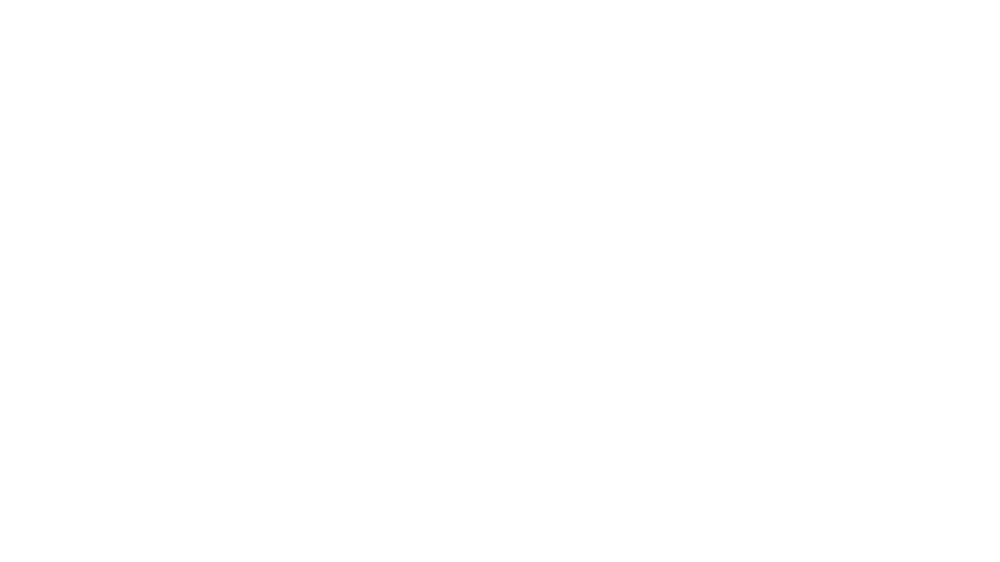

# PurplePlay

Projeto acadêmico de uma plataforma web de streaming fictício, desenvolvido em grupo para explorar autenticação, persistência de dados e experiência do usuário com HTML, CSS e JavaScript puro.



## Visão geral

O PurplePlay simula a navegação de um app de filmes, com fluxo completo de entrada do usuário:

- Cadastro e login com Firebase Authentication (Email/Senha)
- Tela principal com exploração por gêneros
- Modal com sinopse, duração e trailer
- Lista pessoal "Meus Filmes" salva no Firebase Realtime Database
- Remoção de filmes salvos

Projeto online: https://3Gb3.github.io/PurplePlay

## Funcionalidades

### 1. Autenticação

- Cadastro de usuário com validação de senha
- Login com persistência de sessão
- Proteção da página principal para impedir acesso sem autenticação
- Logout ao clicar no avatar

### 2. Explorar filmes

- Catálogo organizado por gêneros (terror, ação, comédia, drama, romance, ficção, suspense e infantil)
- Atualização dinâmica dos 5 cards de filmes por gênero
- Animações de entrada/saída na troca de categoria

### 3. Detalhes de filmes

- Modal com:
	- título
	- sinopse
	- duração
	- trailer incorporado via YouTube

### 4. Meus Filmes

- Salvamento de filmes por usuário autenticado
- Recuperação da lista diretamente do Realtime Database
- Modo de remoção de filmes salvos

## Tecnologias utilizadas

- HTML5
- CSS3
- JavaScript (vanilla)
- Firebase Authentication
- Firebase Realtime Database

## Arquitetura e fluxo

1. O usuário acessa `index.html` e faz cadastro ou login.
2. Ao autenticar, é redirecionado para `principal_v2.html`.
3. A página principal valida sessão + estado de autenticação.
4. Ao salvar um filme, o app grava em `meusFilmes/{uid}/{timestamp}` no Realtime Database.
5. A área "Meus Filmes" busca e renderiza os filmes salvos do usuário atual.

## Estrutura do projeto

```text
PurplePlay/
|- index.html
|- principal_v2.html
|- firebase-config.js
|- script.js
|- sinopse2.js
|- navbarvoltar.js
|- style.css
|- navbar.css
|- sinopse.css
|- Login/
|  |- carregar.css
|  |- fadein.css
|  |- opcao2.css
|- imagens/
|- README.md
```

## Como executar localmente

### Pré-requisitos

- Navegador atualizado
- (Opcional) extensão Live Server no VS Code

### Passo a passo

1. Clone o repositório:

```bash
git clone https://github.com/3Gb3/PurplePlay.git
```

2. Entre na pasta do projeto:

```bash
cd PurplePlay
```

3. Abra o arquivo `index.html` no navegador.

4. Recomendado: usar Live Server para evitar problemas de carregamento local de recursos.

## Configuração do Firebase

O projeto já possui um `firebase-config.js`, mas se você quiser usar seu próprio ambiente:

1. Crie um projeto no Firebase.
2. Ative Authentication com método Email/Senha.
3. Ative Realtime Database.
4. Substitua o objeto de configuração em `firebase-config.js`.

Exemplo:

```js
const firebaseConfig = {
	apiKey: "SUA_API_KEY",
	authDomain: "SEU_PROJETO.firebaseapp.com",
	projectId: "SEU_PROJECT_ID",
	storageBucket: "SEU_BUCKET.appspot.com",
	messagingSenderId: "SEU_SENDER_ID",
	appId: "SEU_APP_ID",
	databaseURL: "https://SEU_PROJETO-default-rtdb.firebaseio.com/"
};
```

### Estrutura de dados esperada (Realtime Database)

```json
{
	"meusFilmes": {
		"uid-do-usuario": {
			"timestamp": {
				"titulo": "Interestelar",
				"sinopse": "...",
				"duracao": "2h 49min",
				"trailer": "https://www.youtube.com/embed/..."
			}
		}
	}
}
```

## Minha participação

Minha atuação principal foi na parte de integração e lógica de autenticação/dados:

- integração com Firebase Authentication
- integração com Firebase Realtime Database
- conexão entre fluxo de UI e persistência dos dados
- desenvolvimento do fluxo de login/cadastro

## Créditos

Projeto desenvolvido por 4 colegas de faculdade como trabalho acadêmico.
